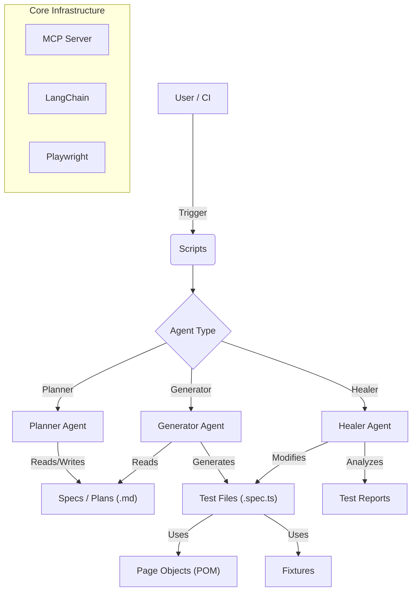

# LLM-Playwright Automation Framework

A next-generation test automation framework that leverages Large Language Models (LLMs) and the Model Context Protocol (MCP) to plan, generate, and heal Playwright tests autonomously.
[Read my Blog Post: The Death of the Flaky Test - Why I Stopped Writing Scripts and Started Architecting Agents](https://ivandimov.dev/the-death-of-the-flaky-test-why-i-stopped-writing-scripts-and-started-architecting-agents)
## 🚀 Project Overview

The **LLM-Playwright** project demonstrates an advanced approach to end-to-end testing where AI agents collaborate to maintain test quality and coverage.

### Key Features
- **🤖 Planner Agent**: Converts high-level requirements into detailed, structured test plans (Markdown).
- **✍️ Generator Agent**: Translates test plans into executable Playwright code, adhering to project architecture (Page Object Model).
- **❤️‍🩹 Healer Agent**: Automatically detects test failures, analyzes the root cause, and applies fixes to the code.
- **🎭 Playwright Integration**: Built on top of Microsoft Playwright for reliable, cross-browser automation.
- **🔌 MCP Architecture**: Uses the Model Context Protocol to standardize tool usage and agent communication.

### Test Logic
 The framework includes a mix of tests:
- **Passing Tests**: Verify core functionalities like Login, Inventory sorting, and Checkout flow.
- **Negative Tests**: Intentionally verify error states (e.g., "Locked Out User", "Invalid Credentials"). These are *passing tests* that assert the presence of error messages, ensuring the application handles failures gracefully.
- **Self-Healing Capabilities**: The architecture supports "failing tests" as input for the **Healer Agent**, which can autonomously correct selectors or logic to make them pass.

---

## 🏗️ Architecture

The project follows a modular architecture designed for scalability and AI interaction.



### Components
- **`scripts/`**: Entry points for the agents (`planner.ts`, `generator.ts`, `healer.ts`).  They initialize the MCP client and LangChain environment.
- **`.github/agents/`**: Markdown-based agent definitions containing system prompts and tool configurations.
- **`tests/`**: Contains the actual Playwright test specifications.
- **`specs/`**: Stores the high-level test plans and coverage requirements in Markdown.
- **`pages/`**: Implements the Page Object Model (POM) to encapsulate page-specific logic.
- **`fixtures/`**: Custom Playwright fixtures for dependency injection (e.g., initializing Page Objects).

---

## 📦 Prerequisites

Ensure you have the following installed:
- **Node.js** (v18 or higher)
- **npm** (or pnpm/yarn)
- **Ollama** (Optional, for local LLM execution)

You also need an API key for the LLM provider (OpenAI or DeepSeek), or a local Ollama instance.

---

## 🛠️ Installation

1.  **Clone the repository:**
    ```bash
    git clone https://github.com/iddimov/llm-playwright.git
    cd llm-playwright
    ```

2.  **Install dependencies:**
    ```bash
    npm install
    # or
    pnpm install
    ```

3.  **Configure Environment Variables:**
    Create a `.env` file in the root directory:
    ```ini
    # LLM Provider Selection (deepseek or ollama)
    LLM_PROVIDER=deepseek

    # DeepSeek Configuration
    DEEPSEEK_API_KEY=your_deepseek_key

    # Ollama Configuration (if LLM_PROVIDER=ollama)
    OLLAMA_BASE_URL=http://localhost:11434/v1
    OLLAMA_MODEL=deepseek-r1:7b

    # Application Credentials (for SauceDemo)
    TEST_USER=standard_user
    TEST_PASSWORD=secret_sauce
    LOCKED_USER=locked_out_user
    ```

4.  **Install Playwright Browsers:**
    ```bash
    npx playwright install
    ```

---

## 🏃‍♂️ How to Run

### 1. Run Tests Manually
Execute the full test suite using standard Playwright commands:
```bash
npm test
# or
npx playwright test
```

### 2. Run the Planner Agent
Generate a new test plan from a description:
```bash
npm run planner "Create a test plan for the shopping cart functionality"
```
*Output will be saved to `specs/coverage.plan.md` by default.*

### 3. Run the Generator Agent
Generate executable test code from the existing plan:
```bash
npm run generator
```
*Reads `specs/coverage.plan.md` and creates/updates `.spec.ts` files in `tests/`.*

### 4. Run the Healer Agent
Attempt to fix failing tests automatically:
```bash
npm run healer
```
*Runs the test suite, identifies failures, and attempts to patch the code.*

---

## 📚 Dependencies

Key dependencies used in this project:

| Package | Purpose |
| :--- | :--- |
| **`@playwright/test`** | Core browser automation framework. |
| **`mcp-use`** | Model Context Protocol client for AI agent tools. |
| **`langchain`** | Orchestration framework for LLM interactions. |
| **`@langchain/openai`** | Adapter for OpenAI-compatible models (including DeepSeek). |
| **`dotenv`** | Environment variable management. |
| **`tsx`** | TypeScript execution for scripts. |

---

**Happy Testing with AI! 🤖**
